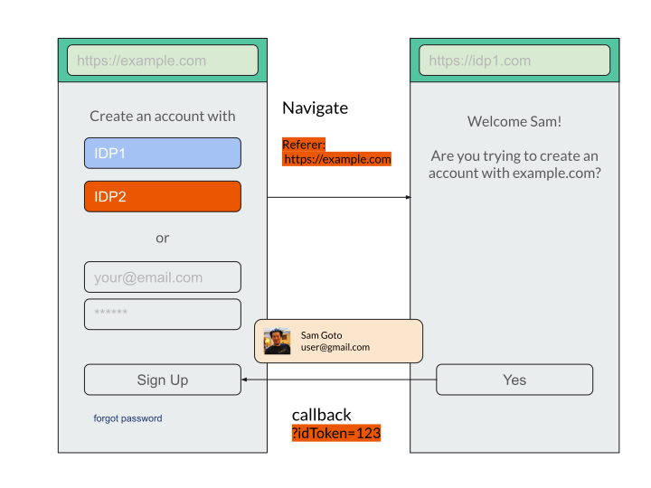

**TL;DR;**: In this document we outline the privacy challenges of single sign-on federation on the Web. An early exploration of ways to address them can be found [here](proposal.md).

# Problem Statement

Identity federation has played an important role in raising the bar for authentication on the web, offering an easier to use (e.g. passwordless single sign on), more secure (e.g. improves resistance to phishing and credential stuffing attacks) and trustworthy system compared to usernames and passwords.

However, from a **privacy perspective**, federation has some adversarial challenges, namely:

- tracking by [relying parties](#rp-tracking-and-joinability) (RPs)
- tracking by [identity providers](#idp-tracking-and-opaque-data-exchange) (IDPs)

And several usability problems with room from improvement, namely:

- the [NASCAR screen](#friction)
- [cumbersome](#friction) navigation

We’ll go over each of these below.

# RP Tracking and Joinability

Relying party tracking is enabled through federation when services that the user signs in to **collude** with each other and other entities to deterministically or probabilistically **link** their user's accounts to build and get access to a richer user profile (e.g. one site selling data on browsing history for ads targeting to another service). While this could be enabled without federation per se (user could manually provide a joinable email address or phone number), federated identity providers have an opportunity to address this problem by providing the user with service-specific data and directed identifiers, and, potentially, for browsers to enforce this. 

# IDP Tracking and Opaque Data Exchange

Even if identity providers were to provide site-specific data and directly identifiers, IDPs and RPs can exchange data without the user explicitly being aware of what information is flowing between the parties, and that the IDP may have insight into the user’s activity across sites. Federation is implemented via parameters on redirects / top level navigation, which allow for arbitrary data exchange, without insight or controls by the user’s browser.

# Friction

From a **usability perspective**, there are also some problems with federation:

- **The [NASCAR](https://developers.google.com/identity/toolkit/web/federated-login#the_nascar_page) screen**: every website has a different sign-in process and has to show a list of supported identity providers for the users to choose. The user is left to determine which identity provider to user, which one they may have used last time, what might happen if they pick a different IDP this time, and what what data might get shared, typically without any support from the browser in remembering the user’s past choice or highlight relevant options. We believe that, by pulling some of the responsibility for the browser, we can offer a personalized IDP disambiguation UI which can lead to higher conversion rates, but yet maintain user privacy.
- **Cumbersome navigation**: full page redirects take the user out of context of the site they were trying to use. IDPs also try using pop-up windows, but often because browsers are unaware of the use federation makes of popups, it has to apply a general rule across all usages, often blocking an IDP popup that would be otherwise helpful.

# Related Problems

Although not directly related to federation per se, there exist a number of other authentication and identity related problems that are worth mentioning, which an be addressed by other efforts that may be related to, but pursued independently of efforts to improve federation.

## Session State Opacity

Because session state management is implemented via general purpose low level primitives (e.g. cookies), when users intend to “log-out” there are no guarantee that anything necessarily happens (e.g. the origin can still know who you are, but it can pretend it doesn’t). Only clearing all cookies currently guarantees that an origin is not **adversarially tracking** you post log-out. There are proposals such as [IsLoggedIn](https://github.com/WebKit/explainers/tree/master/IsLoggedIn) to address this issue.

## Identity Attribute Verification

Verifying phone numbers and emails is tedious: currently, verification often done manually by users without assistance from the browser or IDP. For example, to verify email addresses a service typically sends an OTP (one-time code) to the user’s inbox to be copied/pasted. Similarly, for phone numbers, an SMS message is sent to the user’s phone to be copied/pasted too. There are clear ways here where the browser can step in to help (e.g. [WebOTP](https://github.com/WICG/WebOTP)), and it would generally preferable for authoritative identity providers to assert these attributes wherever possible.

## Cross device sign-in

Because cookies are not propagated across devices, a user has to sign back in (and remember account info, etc) on new devices. Often they end up having to go through a recovery flow, creating a duplicate account, or abandoning completely. Identity providers play an important role in facilitating cross-device sign-in, but we may be able to solve this more generally for user irrespective of their chosen authentication mechanism by expanding on web platform functionality such as the [Credential Management API](https://www.w3.org/TR/credential-management-1/).

# Strawman Proposal

While this is still very much in formation and evolving rapidly, the following seems to be firm enough to serve as a baseline for discussion.

You can read more about in the [strawman proposal](proposal.md) document.