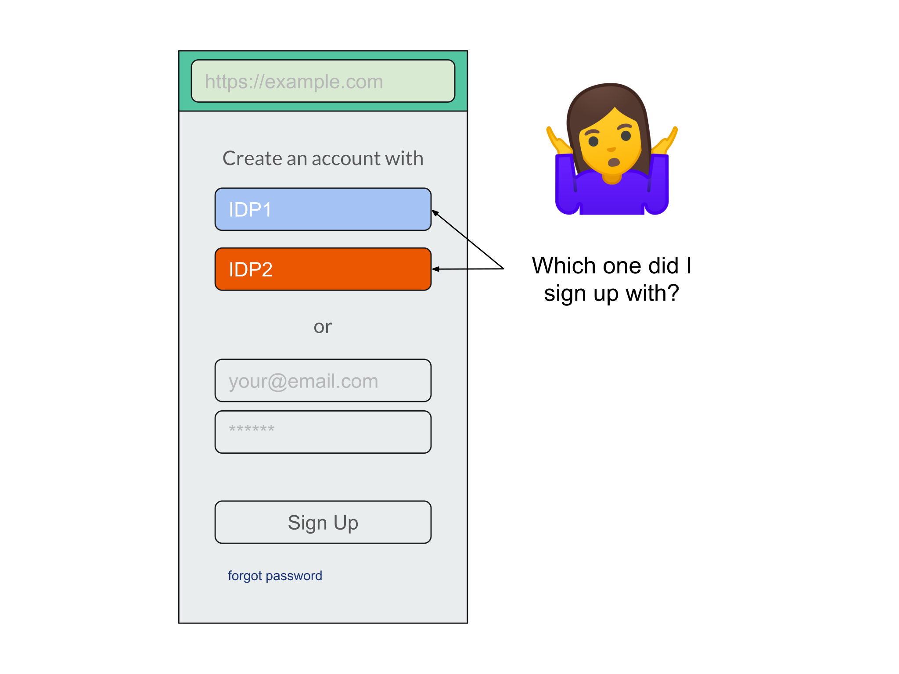

# Related Problems

Although not directly related to federation, there exist a number of other authentication and identity related problems that are worth mentioning, which can be addressed by other efforts that may be related to, but pursued independently of, efforts to improve federation.

## The [NASCAR flag](https://developers.google.com/identity/toolkit/web/federated-login#the_nascar_page) problem

Every website has a different sign-in process and has to show a list of supported identity providers for users to pick from. The user is left to determine which identity provider to choose, which one they may have used last time, what might happen if they pick a different IDP this time, and what data might get shared, typically without any support from the browser in remembering the user’s past choice or highlighting relevant options. We believe that, by pulling some of the responsibility for the browser, we can offer a personalized IDP disambiguation UI which can lead to higher conversion rates, yet maintain user privacy.

## Identity Attribute Verification

Verifying phone numbers and emails is tedious: currently, verification is often done manually by users without assistance from the browser or IDP. For example, to verify email addresses a service typically sends an OTP (one-time code) to the user’s inbox to be copied/pasted. Similarly, for phone numbers, an SMS message is sent to the user’s phone to be copied/pasted too. There are clear ways here where the browser can step in to help (e.g. [WebOTP](https://github.com/WICG/WebOTP)), and it would generally be preferable for authoritative identity providers to assert these attributes wherever possible.

## Cross-device sign-in

Because cookies are not propagated across devices, a user has to sign in (and remember account info, etc.) on new devices. Often they end up having to go through a recovery flow, or create a duplicate account, or abandon sign-in completely. Identity providers play an important role in facilitating cross-device sign-in, but we may be able to solve this more generally for users irrespective of their chosen authentication mechanism, by expanding on Web Platform functionality such as the [Credential Management API](https://www.w3.org/TR/credential-management-1/).

## The Session State Opacity Problem

Because session state management is implemented via general purpose low-level primitives (namely, cookies), when users intend to “log-out” there are no guarantees that anything necessarily happens (e.g. the origin can still know who you are, but it can pretend it doesn’t). Only clearing all cookies currently guarantees that an origin is not **adversarially tracking** you post log-out. There are proposals such as [IsLoggedIn](https://github.com/WebKit/explainers/tree/master/IsLoggedIn) to address this issue.

